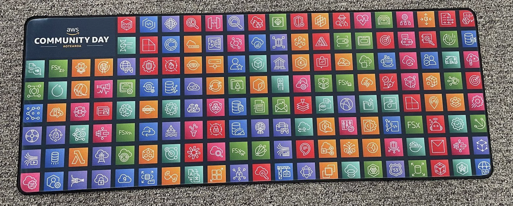
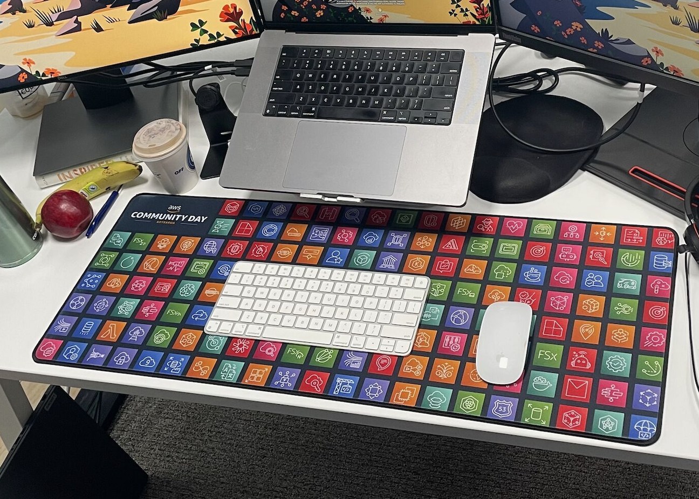

# AWS Community Day Gaming Mat Design Generator

## Overview

- This Python script generates a design filled with randomly selected AWS Architecture Icons.
- I was inspired by the custome made AWS Architecure Icons Mouse Pad which was given away at Poland AWS Community Day - Warsaw. Thank you, [Rafa Mitua](https://www.linkedin.com/in/rmitula/) for the support in assisting with design the Gaming Mat for AWS Community Day Aotearoa (New Zealand).
- We gave away a special Swag "Cool Gaming Mat" at AWS Community Day Aotearoa (New Zealand), and we received such wonderful comments on the Gaming Mat which I decided to share the steps in the hope that it may help other AWS Communities. 







## Prerequisites

Before using this script, ensure you have the following:

- Python installed on your system.
- The Python Imaging Library (PIL), which can be installed using `pip install Pillow`.

## Usage

1. **Set Up Your Project:**

   - Define the dimensions of the gaming mat design (`mat_width` and `mat_height`) in pixels.
   - Specify the directory where your icons to be located (`icons_directory`).

2. **Finding Icons:**

   - Download the Icons from : (https://aws.amazon.com/architecture/icons/)
   - The script will recursively search for icons with the filename pattern `@5x.png` in the `icons` directory and its subdirectories.
   - `@5x.png` files are high resolution icons.
   - All matching icons will be collected and stored in a list.

3. **Maintain Aspect Ratio:**

   - The number of rows and columns are calculated to maintain the desired aspect ratio of the gaming mat design.
   - Icons will be shuffled randomly to ensure a random distribution.

4. **Generate the Gaming Mat Design:**

   - The script creates a blank image with the specified dimensions using PIL.

5. **Place Icons on the Mat:**

   - Icons are placed one by one on the gaming mat design while maintaining the aspect ratio.
   - The script opens each icon, calculates its size while considering the desired space between icons, resizes it, and pastes it onto the mat.

6. **Save the Mat:**

   - The generated gaming mat design is saved as an image file (e.g., `gaming_mat.png`).

7. **Find a Place to Print:**

   - We decided to print the end product on this game mat.: https://www.trends.nz/item/121956

## Running the Script

To run the script, execute the following command:

```bash
python gaming_mat_generator.py
